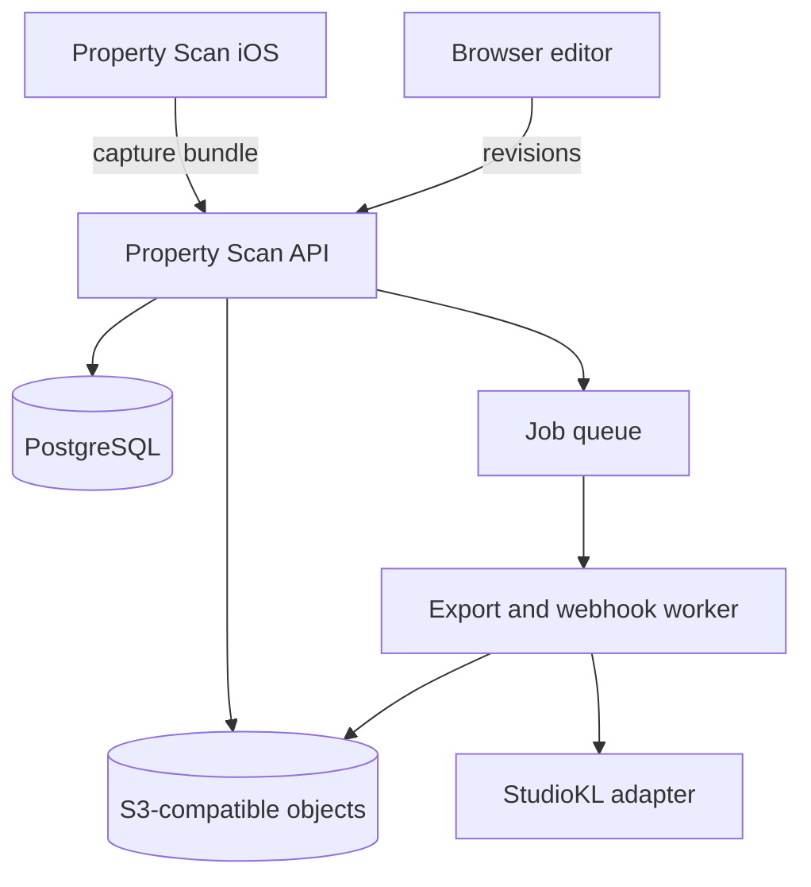
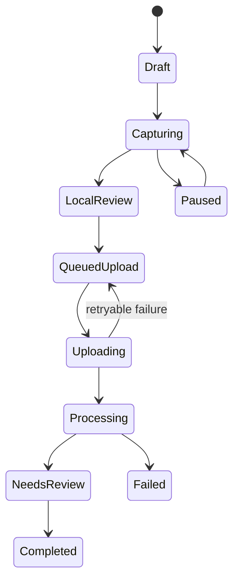

# Property Scan — Implementation Specification and Codex Execution Contract

**Status:** Approved for scaffolding and V1 implementation  
**Working product name:** Property Scan (replaceable)  
**Primary customer:** StudioKL  
**Product model:** Multi-tenant SaaS for construction companies  
**Initial devices:** LiDAR-equipped iPhone and iPad  
**Test hardware:** iPhone 15 Pro and iPad Pro  
**Document date:** 2026-07-21

---

## 1. Instructions to Codex

This file is the implementation contract. Read it fully before editing code.

Codex is authorized to scaffold and implement V1, including the native iOS app, API, worker, browser editor, local infrastructure, tests, documentation, and a reference StudioKL integration. Do not silently reduce the requirements to a mock UI, static floor-plan image, single-room demo, or Apple JSON viewer.

Before implementation:

1. Inspect the entire repository, `AGENTS.md`, existing documentation, lockfiles, CI, and uncommitted changes.
2. If starting from an empty repository, use the monorepo layout in section 8.
3. Record material deviations in `docs/architecture/decisions/` as ADRs.
4. Never commit credentials, Clerk secrets, Apple signing assets, production database URLs, or object-storage credentials.
5. Preserve a runnable vertical slice at the end of every phase.
6. Use deterministic fixtures so backend and web development do not depend on having the iPhone connected.
7. Do not claim installation-ready measurement accuracy. The system is for preliminary estimation unless measurements have been independently verified.

If the StudioKL repository is available, inspect it read-only first and implement the adapter against its actual conventions. Do not couple Property Scan's core schema to StudioKL's current database tables.

## 2. Product Definition

Property Scan captures an indoor property with Apple RoomPlan on supported LiDAR devices, converts the capture into a vendor-neutral spatial model, allows a user to correct the result in a browser, and produces:

- an editable multiroom 2D floor plan for one floor;
- structured room, wall, door, window, and opening records;
- window and door schedules with linked photos;
- confidence and verification status for every measurement;
- PDF and SVG exports;
- versioned JSON through a REST API;
- scan-session deep links, completion webhooks, and import endpoints for StudioKL.

The product is not a survey instrument, permit drawing service, code-compliance system, or replacement for final field measurement.

### 2.1 V1 success outcome

A construction-company user can create a property, initiate a scan, scan multiple connected rooms on one floor, review alignment, upload the result, correct geometry and labels in a browser, attach opening photos, mark important measurements as laser-verified, export PDF/SVG, and deliver normalized openings to StudioKL through an authenticated API and webhook.

### 2.2 V1 non-goals

- Android capture.
- Non-LiDAR automatic capture.
- Multiple floors or stair reconstruction.
- Wi-Fi CSI or RF mapping.
- Automatic material, damage, or condition recognition.
- Installation-grade measurement certification.
- Automatic BIM/Revit/DWG generation.
- Photorealistic 3D tours.
- Billing and public self-service subscriptions; tenancy and entitlements must nevertheless be designed correctly.
- AI-generated corrections without user confirmation.

## 3. Architectural Principles

1. **Apple is a capture adapter, not the domain model.** Persist the original RoomPlan artifact, but normalize it into the Property Scan schema.
2. **Canonical geometry is metric and two-dimensional.** Store canonical lengths in meters and transforms in a documented right-handed coordinate system. Convert to imperial only for display/export.
3. **Every edit creates a revision.** Never destructively overwrite accepted geometry.
4. **Measurements carry provenance.** A number without source, uncertainty, and verification state is incomplete.
5. **The API owns truth.** PDF, SVG, schedules, and integrations are projections of normalized JSON.
6. **Tenant isolation is enforced server-side and in the database.** Client-supplied organization IDs are not authorization.
7. **Async work is explicit.** Imports, renderings, exports, webhook delivery, and media processing run as idempotent jobs.
8. **Offline capture is mandatory.** A jobsite may have poor connectivity. The iOS app must safely resume uploads.
9. **Human correction is part of the product.** RoomPlan output is probabilistic and must remain editable.

## 4. System Context



### 4.1 Deployable components

| Component      | Technology                       | Responsibility                                                         |
| -------------- | -------------------------------- | ---------------------------------------------------------------------- |
| iOS capture    | Swift, SwiftUI, RoomPlan, ARKit  | Scan, local review, photos, durable upload                             |
| API            | TypeScript, Node.js LTS, Fastify | Auth, tenancy, domain operations, signed uploads, integration API      |
| Web            | Next.js, React, TypeScript       | SaaS shell, property records, 2D editor, schedules, export UI          |
| Worker         | TypeScript Node process          | Import normalization, validation, SVG/PDF, thumbnails, webhooks        |
| Database       | PostgreSQL                       | Canonical records, revisions, authorization metadata, jobs             |
| Object storage | S3-compatible                    | Raw captures, photos, previews, exports, immutable artifacts           |
| Queue          | PostgreSQL-backed initially      | Reliable async jobs without an extra required service                  |
| Identity       | Clerk                            | User sign-in and identity; application DB owns organizations and roles |

Recommended initial hosting: managed PostgreSQL through Supabase, an S3-compatible object store, and containerized API/worker. Supabase is infrastructure here, not the authoritative authentication layer.

## 5. Device and Apple Requirements

- Minimum deployment target: choose the oldest iOS version that supports the exact multiroom/structure APIs used after compiling against the installed Xcode SDK. Prefer iOS 17+ unless current SDK requirements force a later target.
- Gate scanning with runtime capability checks. Show a precise unsupported-device message rather than crashing or offering fake capture.
- Use `RoomCaptureView`/`RoomCaptureSession` for guided capture.
- Use RoomPlan multiroom structure-building APIs where available. Retain each constituent room capture and transform.
- Export and preserve RoomPlan's Codable representation and USDZ when available.
- Add `NSCameraUsageDescription`; request camera access just in time.
- Do not require a network connection during capture.
- Do not implement Bluetooth laser support by guessing a universal protocol. Define a provider interface and ship manual verified-entry first; integrate a named BLE model only after hardware/protocol selection.

Apple signing must use developer-local configuration. Commit an unsigned project definition and documented setup, never certificates or provisioning profiles.

## 6. Capture Workflow

### 6.1 State machine



States must be represented explicitly in both local storage and server records. UI labels may differ, but transitions must be validated.

### 6.2 One-floor multiroom capture

V1 supports several rooms on one floor. Automatic alignment is preferred when the RoomPlan structure result is valid. Manual correction is required as fallback.

Capture UX must:

1. Open from a universal/deep link containing an opaque, short-lived handoff token—not an API secret.
2. Download scan-session metadata if online or accept a previously cached assignment.
3. Guide the user to begin near a doorway and move slowly around walls and openings.
4. Display coverage/coaching feedback from RoomPlan.
5. Allow pause/resume and explicit completion of each room.
6. Ask the user to identify the connection between successive rooms if automatic structure alignment is uncertain.
7. Permit local room naming and deletion before upload.
8. Capture opening photos separately; never assume RoomPlan preserves useful texture imagery.
9. Create a capture manifest, checksums, and local immutable artifacts.
10. Upload with resumable, idempotent behavior.

### 6.3 Capture bundle

The iOS app creates a versioned bundle:

```text
capture-bundle/
  manifest.json
  roomplan/
    room-<uuid>.json
    structure.json              # when available
  models/
    structure.usdz              # optional
  media/
    <media-uuid>.heic
  diagnostics/
    capture-events.ndjson
```

`manifest.json` includes schema version, scan ID, client-generated capture ID, device model, OS/app versions, units, room IDs, file SHA-256 values, capture timestamps, and declared coordinate-system metadata. It must not contain authentication tokens.

Camera frames, point clouds, and detailed telemetry are not uploaded by default. Any future collection requires explicit purpose, retention, consent, and tenant controls.

## 7. Spatial Domain Model

### 7.1 Coordinate conventions

- Canonical unit: meter.
- Canonical floor plan: X/Z projected to 2D `(x, y)` in a floor-local coordinate system.
- Vertical coordinate: meters above floor datum.
- Angles: radians in storage, degrees in human-facing exports where useful.
- Transform: 4×4 matrix serialized in column-major order only when 3D source transforms must be preserved.
- Polygon winding and origin conventions must be declared in `packages/geometry/README.md` and enforced in tests.
- Never compare floating-point coordinates using exact equality. Define geometry tolerances centrally.

### 7.2 Core entities

```text
Organization
  Membership
  Property
    Floor
      ScanSession
        CaptureArtifact
        ImportRun
      Plan
        PlanRevision
          Room
          Wall
          Opening
          Measurement
          Annotation
          MediaLink
        Export
    IntegrationConnection
    WebhookEndpoint
```

### 7.3 Important records

**Property:** tenant-scoped address and external references. Address fields are separable; no address is required for scanning.

**Floor:** name, ordinal, elevation, display units. V1 permits one active scanned floor but the schema must not prevent future floors.

**ScanSession:** capture lifecycle, assigned user/device, handoff token hash, timestamps, processing status, and failure details.

**PlanRevision:** immutable snapshot/reference with parent revision, author type, reason, status (`draft`, `accepted`, `superseded`), geometry schema version, and optimistic concurrency version.

**Wall:** stable UUID, start/end vertices, thickness if known, height if known, source reference, confidence.

**Opening:** stable UUID, type (`window`, `door`, `open_passage`, `unknown`), host wall, center/offset along wall, width, height, sill height, swing/handing where known, room associations, confidence, verification state.

**Measurement:** value, unit, semantic type, subject ID, source (`roomplan`, `manual`, `laser`, `derived`), captured by, captured at, estimated uncertainty, verification status, supersedes ID, notes.

**Media:** object key, MIME, byte size, checksum, pixel dimensions, capture timestamp, EXIF policy, thumbnail status. Link media to a room/opening/annotation through a typed join record.

### 7.4 Measurement state

```text
unverified -> reviewed -> field_verified
                    \-> rejected
```

RoomPlan-derived values begin `unverified`. A user visual review may mark `reviewed`; it does not become `field_verified`. A laser/manual field entry can be `field_verified` only with user identity, timestamp, method, and optionally device metadata.

Do not blend a verified value into a source measurement. Add a new measurement that supersedes it and preserve history.

### 7.5 Confidence

Confidence is not an invented percentage. Store:

- source confidence if Apple provides a meaningful category;
- platform quality flags (alignment warning, incomplete wall, unattached opening);
- a platform confidence level (`high`, `medium`, `low`, `unknown`) derived by a documented rule;
- specific reason codes.

Do not display fake precision such as `93.7% accurate` without a validated calibration model.

## 8. Repository Scaffolding

Use a monorepo. Recommended package manager: `pnpm`; task runner: Turborepo. Pin the package-manager version and Node LTS in the root.

```text
property-scan/
  apps/
    api/                       # Fastify REST API
    web/                       # Next.js browser application/editor
    worker/                    # background jobs
    ios/                       # Xcode project/workspace and Swift sources
  packages/
    contracts/                 # OpenAPI-generated/shared TS contracts
    database/                  # schema, migrations, repositories, seeds
    geometry/                  # pure geometry operations
    roomplan-fixtures/         # sanitized deterministic fixtures
    rendering/                 # SVG/PDF projection
    auth/                      # Clerk server helpers and policies
    observability/             # logging, tracing, metrics
    config/                    # validated environment schemas
    eslint-config/
    typescript-config/
  integrations/
    studiokl/                  # reference adapter and mapping docs
  docs/
    architecture/
      decisions/
    api/
    operations/
    privacy/
    testing/
  infra/
    docker/
    terraform/                 # optional until target account exists
  scripts/
  .github/workflows/
  compose.yaml
  .env.example
  Makefile
  package.json
  pnpm-workspace.yaml
  turbo.json
  README.md
```

### 8.1 Required local commands

```bash
pnpm install
pnpm dev
pnpm build
pnpm lint
pnpm typecheck
pnpm test
pnpm test:integration
pnpm test:e2e
pnpm db:migrate
pnpm db:seed
```

Provide `make bootstrap`, `make dev`, and `make verify` as discoverable wrappers. Local startup must use non-production PostgreSQL and object storage. Email, outbound webhooks to non-local hosts, and destructive integrations must be disabled by default.

## 9. Backend Implementation

### 9.1 API style

- REST under `/v1`.
- OpenAPI 3.1 is the contract source; validate requests and responses.
- JSON uses camelCase externally and consistent database naming internally.
- UUIDv7/UUID acceptable; use one standard consistently.
- UTC ISO 8601 timestamps.
- Cursor pagination for collections.
- Problem Details (`application/problem+json`) for errors.
- `Idempotency-Key` required for creation calls that may be retried.
- `ETag`/revision version or explicit `expectedRevision` for correction conflicts.

### 9.2 Minimum endpoints

```http
POST   /v1/properties
GET    /v1/properties/{propertyId}
POST   /v1/properties/{propertyId}/floors

POST   /v1/scan-sessions
GET    /v1/scan-sessions/{scanSessionId}
POST   /v1/scan-sessions/{scanSessionId}/handoff-token
POST   /v1/scan-sessions/{scanSessionId}/uploads
POST   /v1/scan-sessions/{scanSessionId}/uploads/{uploadId}/complete
POST   /v1/scan-sessions/{scanSessionId}/complete

GET    /v1/plans/{planId}
GET    /v1/plans/{planId}/revisions/{revisionId}
POST   /v1/plans/{planId}/revisions
POST   /v1/plans/{planId}/revisions/{revisionId}/accept
GET    /v1/plans/{planId}/openings
GET    /v1/plans/{planId}/schedules/windows
GET    /v1/plans/{planId}/schedules/doors

POST   /v1/media/uploads
POST   /v1/media/uploads/{uploadId}/complete
POST   /v1/openings/{openingId}/media-links
POST   /v1/measurements

POST   /v1/exports
GET    /v1/exports/{exportId}

POST   /v1/integrations
POST   /v1/webhook-endpoints
GET    /v1/webhook-deliveries/{deliveryId}
POST   /v1/webhook-deliveries/{deliveryId}/retry
```

### 9.3 Example scan-session request

```json
{
  "propertyId": "019...",
  "floorId": "019...",
  "requestedOutputs": ["normalized_json", "svg", "pdf"],
  "externalReferences": [{ "system": "studiokl", "type": "job", "value": "job_123" }]
}
```

Response includes a scan ID, status, deep-link URL, browser fallback URL, and expiration. It never returns reusable service credentials.

### 9.4 Import pipeline

1. Verify manifest schema, expected IDs, file sizes, checksums, and MIME types.
2. Virus/malware scan media where infrastructure supports it.
3. Deserialize RoomPlan capture using a version-compatible adapter.
4. Preserve raw artifacts as immutable objects.
5. Normalize rooms, surfaces, transforms, openings, and measurements.
6. Validate topology: wall lengths, closed-room candidates, opening/host relationships, duplicate identifiers, and transform sanity.
7. Build or ingest multiroom alignment.
8. Emit quality findings rather than silently deleting questionable geometry.
9. Create the initial immutable plan revision transactionally.
10. Queue thumbnails and requested exports.
11. Transition to `needs_review` and emit a webhook only after durable commit.

Import must be repeatable. The same bundle checksum and scan ID must not create duplicate plans.

### 9.5 Data access and tenant enforcement

Every tenant-owned table contains `organization_id`. Resolve organization membership from authenticated identity and server-side context. Use PostgreSQL row-level security where practical as defense in depth, but do not make RLS the only authorization layer.

Roles:

- `owner`: organization and integration administration;
- `admin`: users, projects, exports, endpoints;
- `member`: create/edit scans and plans;
- `viewer`: read/export only.

Service accounts use scoped credentials stored hashed or encrypted and support rotation. StudioKL must receive only the scopes it needs.

## 10. Browser Editor

### 10.1 Editor requirements

The editor is an SVG-based or Canvas/WebGL-assisted 2D application with a deterministic model layer. Rendering technology must not become the data model.

Required tools:

- pan, zoom, fit-to-floor;
- select rooms, walls, doors, windows, and open passages;
- move wall endpoints with snapping;
- edit wall length through numeric entry;
- move an opening along its host wall;
- edit opening width, height, sill, type, and room association;
- name rooms;
- inspect source/confidence/verification status;
- attach/reorder opening photos;
- enter a manual or laser-verified measurement;
- undo/redo within an editing session;
- save draft revision;
- display validation issues before accepting;
- compare current and previous revisions.

Do not permit an edit that leaves an opening detached without either reattaching it or explicitly marking it unresolved.

### 10.2 Geometry command model

Represent edits as typed commands (`moveVertex`, `setWallLength`, `moveOpening`, `updateOpening`, `renameRoom`) and reduce them into a candidate revision. Validate commands server-side. Do not accept arbitrary replacement JSON from the browser as the primary correction mechanism.

Use optimistic concurrency. If another revision was accepted, reject stale saves with a conflict response and provide sufficient metadata to reload/compare.

### 10.3 Accessibility and usability

- Keyboard-accessible property/schedule forms.
- Visible focus states and non-color-only warnings.
- Touch-compatible editor controls for iPad browser use.
- Imperial display defaults for StudioKL/US tenants; retain metric source of truth.
- Fractions rounded using explicit tenant-configured increments (for example nearest 1/8 inch) only for display.

## 11. Rendering and Exports

### 11.1 SVG

SVG is the editable vector deliverable, not the canonical database.

Requirements:

- viewBox in a documented scale;
- grouped/labeled layers for walls, openings, dimensions, room labels, and annotations;
- stable entity IDs in `data-*` attributes;
- embedded metadata with export/schema/revision IDs;
- no remote fonts or remote images;
- sanitized text;
- deterministic output for the same revision and options.

### 11.2 PDF

PDF includes:

- title block, property/floor, revision, timestamp, and disclaimer;
- scaled floor plan with scale bar (do not claim a print scale unless page dimensions are controlled);
- room names and dimensions;
- windows and doors keyed to schedules;
- window schedule;
- door schedule;
- verification legend and unresolved-item list;
- page numbers.

PDF generation must run server-side from the same geometry projection used by SVG. Golden-file or visual-regression tests are required.

### 11.3 Structured JSON

The normalized JSON response is always available even if the UI asks only for PDF/SVG. It contains schema version, identifiers, coordinate conventions, geometry, schedules, measurement provenance, validation findings, and signed media URLs only when authorized and short-lived.

## 12. StudioKL Integration

No StudioKL endpoints currently exist. Implement both sides as a minimal, isolated integration.

### 12.1 Workflow

1. StudioKL creates a Property Scan session with its job/project external reference.
2. Property Scan returns a deep link and QR-ready URL.
3. Field user opens the iOS scanner and completes capture.
4. Property Scan processes the bundle and emits `scan.needs_review`.
5. User corrects and accepts a revision.
6. Property Scan emits `plan.accepted` and, after render completion, `exports.ready`.
7. StudioKL retrieves openings, media metadata, schedules, and exports.
8. StudioKL maps selected opening records into its estimate/RFQ workflow. Property Scan never writes directly to StudioKL's production database.

### 12.2 Webhook events

```text
scan.processing
scan.needs_review
scan.failed
plan.accepted
exports.ready
```

Webhook envelope includes event ID, type, creation time, organization ID, API version, resource IDs, and minimal payload. Sign the exact raw body using HMAC-SHA256 with timestamp and key ID. Reject replay outside the tolerance window. Support secret rotation, exponential retry with jitter, delivery logs, and manual replay. At-least-once delivery means StudioKL must deduplicate by event ID.

### 12.3 Reference adapter

`integrations/studiokl` must include:

- mapping table from Property Scan opening fields to StudioKL fields;
- a sample server-side client;
- webhook verification middleware;
- idempotent event handler example;
- fixtures and contract tests;
- required StudioKL migrations/endpoints in an isolated patch or integration branch after inspecting the real repo.

## 13. Security and Privacy

- Clerk tokens are verified server-side for issuer, audience, signature, expiry, and authorized party where applicable.
- Use short-lived presigned upload/download URLs with object keys chosen server-side.
- Never expose S3 credentials to clients.
- Encrypt in transit and use provider encryption at rest.
- Strip unnecessary EXIF GPS metadata by default; retain capture time/device data only when needed and disclosed.
- Properties and interior plans are sensitive. Authorization applies to exports and media, not only API JSON.
- Log IDs and state transitions, not raw floor-plan geometry or signed URLs.
- Rate-limit auth, token issuance, uploads, exports, and webhook management.
- Validate upload byte limits, MIME signatures, dimensions, checksums, and decompression limits.
- Define configurable retention for raw capture artifacts and deleted tenants.
- Implement audit events for membership changes, exports, integration credential changes, accepted revisions, and deletion.
- Add account/tenant data export and deletion design notes before public SaaS launch.

Threat-model at least: cross-tenant IDOR, leaked deep links, malicious SVG text, oversized media, webhook forgery/replay, presigned URL reuse, stale revision overwrite, and worker job duplication.

## 14. Reliability and Observability

### 14.1 Job guarantees

- Transactional outbox for events created alongside domain commits.
- Idempotent workers with unique job keys.
- Bounded retries and dead-letter state.
- Lease/heartbeat for long-running jobs.
- User-visible failure reason and retry action.
- No webhook before committed readable state.

### 14.2 Telemetry

Use structured logs, OpenTelemetry-compatible traces, and metrics. Correlate `requestId`, `organizationId`, `scanSessionId`, `importRunId`, and `jobId` while avoiding sensitive geometry.

Minimum metrics:

- capture upload completion/failure rate;
- import duration and failure by adapter/schema version;
- scans reaching accepted plan;
- unresolved validation findings per scan;
- export latency/failure;
- webhook delivery success and retry count;
- API latency/error rate;
- cross-device app/OS version distribution.

Provide `/health/live` and `/health/ready`. Readiness checks required dependencies without making the endpoint expensive.

## 15. Testing Strategy

### 15.1 Required test layers

| Layer               | Required coverage                                                                   |
| ------------------- | ----------------------------------------------------------------------------------- |
| Geometry unit tests | transforms, projection, snapping, wall/opening constraints, tolerance edges         |
| Import fixtures     | single room, multiroom aligned, missing wall, duplicate opening, unsupported schema |
| API integration     | auth, tenancy, idempotency, concurrency, uploads, revisions, schedules              |
| Worker integration  | duplicate job, retry, export determinism, webhook signing/replay                    |
| Web component       | editor commands, undo/redo, forms, validation states                                |
| Browser E2E         | create session → fixture import → edit → accept → export                            |
| iOS unit/UI         | state transitions, offline queue, manifest/checksum, unsupported device UX          |
| Contract            | OpenAPI clients and StudioKL webhook consumer                                       |
| Security            | cross-tenant access matrix and malicious upload/SVG cases                           |

### 15.2 Ground-truth validation

Create a repeatable field validation protocol for the test iPhone 15 Pro and iPad Pro:

1. Scan at least five materially different interiors.
2. Measure selected wall spans, windows, doors, and sill heights with a calibrated laser/tape.
3. Record raw RoomPlan value, corrected value, reference value, absolute error, and conditions.
4. Report median, 90th percentile, and maximum absolute error by measurement type and device.
5. Do not market an accuracy tolerance until this data exists.

Acceptance tests must not assert that RoomPlan is universally within a chosen construction tolerance.

### 15.3 CI gates

Every pull request runs formatting, lint, typecheck, unit tests, database migration checks, API contract diff, integration tests, dependency/security scanning, and web build. iOS compile/tests run on macOS CI when credentials/runners are configured; signing is unnecessary for simulator compilation.

## 16. Database and Migration Rules

Use migrations checked into source control. Never use schema push against shared environments. Migrations must be forward-only in production and tested from an empty database plus the prior released schema.

Recommended tables include:

```text
organizations, memberships, properties, floors,
scan_sessions, scan_handoff_tokens, capture_artifacts, import_runs,
plans, plan_revisions, rooms, walls, openings,
measurements, annotations, media, media_links,
exports, jobs, outbox_events,
integration_connections, service_credentials,
webhook_endpoints, webhook_deliveries, audit_events
```

Geometry entities may be stored in normalized relational rows with JSONB for versioned source metadata. PostGIS is optional; do not add it unless a concrete query justifies it. Store authoritative artifact object keys, not public URLs.

## 17. Configuration

Validate environment variables at startup. `.env.example` contains safe placeholders only.

```text
APP_ENV
API_BASE_URL
WEB_BASE_URL
DATABASE_URL
CLERK_PUBLISHABLE_KEY
CLERK_SECRET_KEY
CLERK_JWT_ISSUER
S3_ENDPOINT
S3_REGION
S3_BUCKET
S3_ACCESS_KEY_ID
S3_SECRET_ACCESS_KEY
UPLOAD_MAX_BYTES
WEBHOOK_MASTER_ENCRYPTION_KEY
OTEL_EXPORTER_OTLP_ENDPOINT
DISABLE_EXTERNAL_WEBHOOKS=true
```

Use a secret manager outside local development. Fail closed when mandatory production secrets are absent.

## 18. Execution Plan

Codex should implement in this order. Each phase ends with tests, documentation, and a runnable demonstration.

### Phase 0 — Repository and architecture baseline

- Initialize monorepo, pinned toolchain, lint/typecheck/test/build.
- Local PostgreSQL and S3-compatible storage.
- ADRs for framework, queue, schema/revisions, geometry coordinates.
- CI, `.env.example`, secret-safe `.gitignore`, health endpoints.

**Exit:** clean clone can bootstrap and pass `make verify`.

### Phase 1 — SaaS and scan-session vertical slice

- Clerk auth, organizations, memberships, properties, floors.
- Tenant-safe data access.
- Scan-session lifecycle, idempotency, handoff token, deep link/QR URL.
- Minimal web dashboard.

**Exit:** authenticated tenant creates a property and scan session; another tenant cannot access it.

### Phase 2 — Native capture and durable upload

- SwiftUI app and capability/camera gating.
- RoomPlan room capture, multiroom/structure path, local review.
- Persistent local capture state and offline upload queue.
- Manifest, checksums, presigned multipart/resumable upload.
- Sanitized sample fixtures checked into the repo.

**Exit:** both target devices can capture and server can receive a valid bundle; interrupted upload resumes.

### Phase 3 — Normalization and plan API

- RoomPlan adapter and immutable raw artifact storage.
- Vendor-neutral geometry model and validation findings.
- Initial plan revision, room/wall/opening API, schedules.
- Fixture-driven import tests.

**Exit:** a real and fixture bundle produce inspectable normalized JSON and window/door schedules.

### Phase 4 — Browser correction editor

- 2D projection and renderer.
- Typed edit commands, constraints, undo/redo, optimistic concurrency.
- Room/opening forms, photos, measurement provenance and verification.
- Revision accept/compare flow.

**Exit:** user corrects an imperfect plan without mutating the source revision and accepts a new revision.

### Phase 5 — PDF/SVG and integration

- Deterministic SVG and paginated PDF.
- Export jobs/status/download authorization.
- Signed webhooks and delivery UI.
- StudioKL reference adapter and contract tests.

**Exit:** StudioKL-style consumer creates a scan, handles accepted-plan event, and imports schedule/media references.

### Phase 6 — Hardening and field validation

- Threat-model fixes, load tests, failure injection, telemetry dashboards.
- iOS device matrix runs on iPhone 15 Pro/iPad Pro.
- Five-property ground-truth study and documented results.
- Backup/restore and operational runbooks.

**Exit:** staging release candidate with known limitations and evidence-backed measurement claims.

## 19. V1 Definition of Done

V1 is done only when all are true:

- A clean environment can run API, web, worker, database, and object storage locally.
- iPhone 15 Pro and iPad Pro can complete a multiroom one-floor scan.
- Capture works offline and resumes upload.
- Raw artifacts are preserved and normalized into vendor-neutral versioned JSON.
- User can correct walls/openings/room names and create an immutable revision.
- Window and door schedules include dimensions, room, media, source, confidence, and verification status.
- PDF and SVG are generated from the accepted revision.
- Cross-tenant authorization tests pass.
- StudioKL reference integration creates sessions and consumes signed, deduplicated webhooks.
- CI is green and no real secrets exist in Git history.
- Error states are recoverable and visible.
- Measurement disclaimers and field-verification workflow are implemented.
- API, setup, operations, privacy, and known-limitations documentation are current.

## 20. Mandatory Engineering Guardrails

Codex must not:

- treat RoomPlan output as installation-ready;
- use SVG/PDF as the source of truth;
- overwrite accepted revisions;
- derive tenant authorization from request-body organization IDs;
- place raw captures or exports in public buckets;
- send webhooks without signatures and retries;
- make capture depend on continuous connectivity;
- build StudioKL-specific fields into core geometry tables;
- implement a fake Bluetooth scanner abstraction that claims hardware support;
- label single-room scanning as whole-property support;
- hide failed geometry behind a successful status;
- expose internal stack traces or signed object URLs in logs;
- merge scaffolding with TODO-only implementations and call V1 complete.

## 21. First Codex Work Order

After reading this document, Codex should return a concise repository assessment and proposed deviations only if necessary, then proceed without waiting unless blocked by a decision that materially changes scope or requires credentials/external publication.

The first implementation work order is:

1. Scaffold Phase 0 completely.
2. Implement Phase 1 as a tested vertical slice.
3. Create the iOS target and compile a capability-gated RoomPlan capture shell.
4. Add one legal/sanitized RoomPlan fixture and implement the manifest contract.
5. Demonstrate the complete placeholder-free path: create tenant/property/session → open handoff link → import fixture bundle → retrieve normalized plan stub with explicit `not_processed` fields where normalization is not yet implemented.
6. Stop claiming completion at that milestone; report exact tests run, unresolved work, and Phase 2 next actions.

## 22. Open Decisions That Do Not Block Scaffolding

These remain configurable and must not cause architectural rework:

- Final product/company name and bundle identifiers.
- Cloud vendor and production accounts.
- Exact BLE laser measurer model/protocol.
- Pricing/billing provider.
- Whether future versions add Android, multiple floors, DXF/BIM, Wi-Fi sensing, or condition recognition.
- Final StudioKL endpoint/table mapping after repository inspection.

## 23. Primary Technical References

- Apple RoomPlan overview and documentation: https://developer.apple.com/augmented-reality/roomplan/
- Apple `CapturedRoom`: https://developer.apple.com/documentation/roomplan/capturedroom
- Apple ARKit: https://developer.apple.com/documentation/arkit
- Apple RoomPlan custom models and structure exports: https://developer.apple.com/documentation/roomplan/providing-custom-models-for-captured-rooms-and-structure-exports
- Clerk backend token verification: https://clerk.com/docs/backend-requests/handling/manual-jwt
- OpenAPI 3.1 specification: https://spec.openapis.org/oas/v3.1.0
- RFC 9457 Problem Details: https://www.rfc-editor.org/rfc/rfc9457

When Apple SDK signatures differ from this document, the installed Xcode SDK and current official Apple documentation control implementation details. Capture the decision and deployment-target impact in an ADR; do not invent compatibility shims without compiling them.

---

## Hard product verdict

This V1 is commercially credible only as a construction-capture workflow, not as a generic floor-plan clone. The moat is the normalized opening data, provenance, correction workflow, exports, and downstream estimating integration. RoomPlan is replaceable infrastructure. If the implementation stops at an attractive scan viewer, it has failed the product objective.
