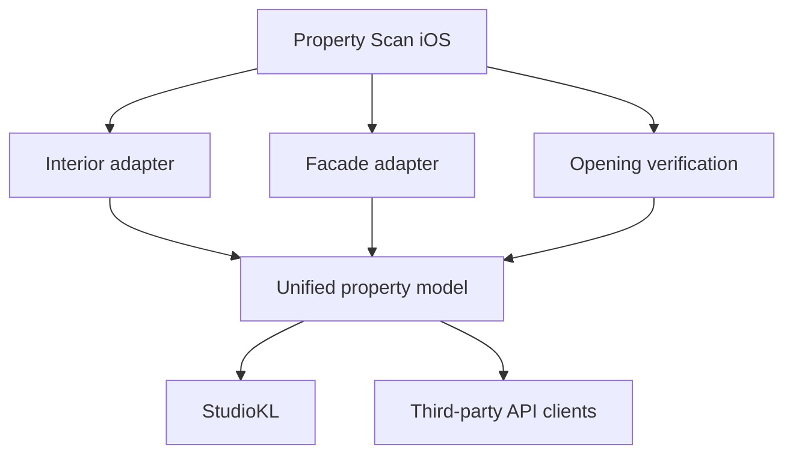
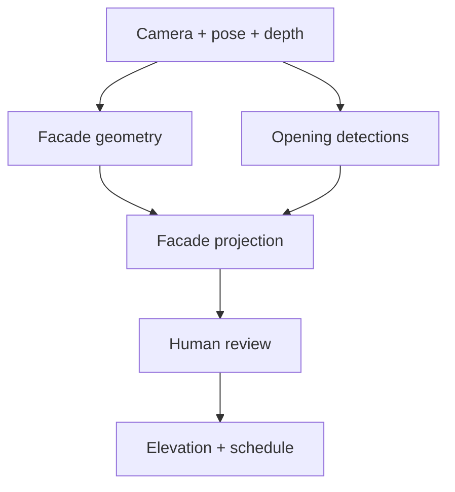

# Property Scan — Exterior Facade Layer Amendment and Codex Execution Contract

**Status:** Approved architectural amendment; implementation follows the interior V1  
**Parent specification:** `PROPERTY_SCAN_DEV.md`  
**Platform:** Property Scan multi-tenant construction-capture SaaS  
**Initial client:** StudioKL  
**Document date:** 2026-07-21

---

## 1. Instructions to Codex

Read `PROPERTY_SCAN_DEV.md` completely before acting. This document adds an exterior facade-capture layer to the same Property Scan platform. It does not replace, redefine, or block the approved interior V1.

Continue the current interior implementation and preserve its acceptance criteria. Do not interrupt a working interior vertical slice to prematurely build exterior computer vision.

During interior development, make only bounded, low-risk architectural changes needed to avoid a later rewrite:

1. Generalize scan sessions to support multiple capture modes.
2. Reserve vendor-neutral facade, elevation, level, observation, and detection concepts.
3. Keep interior and exterior capture artifacts and processing pipelines separate.
4. Reuse common property, opening, measurement, media, revision, export, tenancy, entitlement, job, and webhook infrastructure.
5. Put all unfinished exterior behavior behind disabled tenant-aware feature flags.
6. Record material deviations or architectural decisions in ADRs.
7. Schedule actual exterior implementation only after the interior V1 vertical slice is stable.

Do not claim that scaffolding, schema reservations, hard-coded detections, user-drawn rectangles, or an ARKit mesh viewer constitute an exterior scanner.

## 2. Product and Repository Decision

Property Scan remains one independent SaaS platform. The exterior scanner is a separate capture engine and workflow inside that platform, not a separate company backend and not part of StudioKL's core application.

The platform contains three related capture modes:

- `interior_roomplan`: RoomPlan-based indoor room and floor capture.
- `exterior_facade`: camera, ARKit, LiDAR, geometry, and computer-vision facade capture.
- `opening_verification`: manual AR measurement and later supported Bluetooth-laser verification.

StudioKL is customer number one and consumes Property Scan through a versioned API. Other construction applications must be able to use the same contracts.

Do not create a separate exterior database, authentication system, organization model, billing system, editor framework, integration protocol, or unrelated repository. Separate deployable services may be introduced only when measured scaling, security, hardware, or dependency boundaries justify them.



## 3. Exterior Product Outcome

The exterior module must allow a trained field user to capture one visible building facade and produce:

- a scaled, orthographic facade/elevation representation;
- facade boundary and visible level lines;
- detected windows, exterior doors, garage doors, storefronts, and open passages;
- preliminary opening locations and dimensions;
- deduplicated opening counts;
- an opening schedule grouped by probable size and type;
- photographs linked to each opening and facade region;
- preliminary wall, glazing, and cladding surface areas;
- an editable elevation with immutable revisions;
- normalized, versioned JSON;
- editable SVG and paginated PDF exports;
- API and signed-webhook delivery;
- confidence, completeness, occlusion, provenance, and verification status;
- explicit review queues for uncertain or obstructed observations.

The system must not present phone-derived results as survey-grade, permit-grade, code-certified, or installation-ready unless the relevant dimensions were independently field verified and the product explicitly supports that declared verification method.

### 3.1 Intended initial property envelope

The initial implementation targets detached and attached one- and two-story properties with a reasonably visible facade. Three-story or larger buildings are research/evaluation cases, not an initial accuracy promise.

Phone LiDAR is a short-range geometry aid. Camera-based reconstruction, known reference dimensions, manual correction, or later photogrammetry may be necessary for upper floors and larger facades.

### 3.2 Non-goals for the first exterior release

- High-rise survey or complete building-envelope capture.
- Drone capture or flight control.
- Automatic hidden-opening inference.
- Installation-ready rough-opening measurements from exterior imagery alone.
- Automatic structural, water-intrusion, code, damage, or product-condition assessment.
- Permit drawings, signed/sealed elevations, BIM, Revit, or DWG.
- Fully automatic interior-to-exterior opening matching.
- Raw-video retention without an explicit privacy and lifecycle policy.
- Accuracy claims unsupported by a labeled field dataset.

## 4. Capture UX and State Machine

The iOS app should expose separate top-level workflows: **Scan interior**, **Scan facade**, **Verify opening**, **Review property**, and **Upload/processing status**.

An exterior session follows this conceptual state machine:

```text
created
→ device_check
→ facade_setup
→ reference_setup
→ capturing
→ local_review
→ packaged
→ uploading
→ processing
→ needs_review | ready
→ accepted
```

Terminal failure and cancellation states must be explicit. Interrupted capture and upload must be resumable where the underlying sensor session permits it; otherwise the user must receive a precise instruction to recapture.

### 4.1 Guided field workflow

1. Select or create the property.
2. Select facade orientation/name: front, rear, left, right, cardinal direction, or unknown.
3. Run device, camera-permission, storage, thermal, and tracking-capability checks.
4. Establish the facade coordinate frame and, when available, enter one field-verified reference dimension.
5. Capture a frontal pass while keeping the full accessible facade visible.
6. Capture angled passes for recessed openings and side returns.
7. Mark inaccessible, reflective, shadowed, vegetated, vehicle-obstructed, or otherwise obscured regions.
8. Review coverage, tracking quality, and image sharpness before leaving the site.
9. Confirm obvious opening candidates without converting that confirmation into verified dimensions.
10. Package and durably upload the capture bundle.
11. Review the generated elevation and schedule in the web editor.
12. Correct, reject, classify, group, or field-verify openings.
13. Accept a revision before exports or downstream estimating imports are treated as authoritative.

The user interface must actively discourage a fast single sweep when coverage is insufficient.

## 5. Native Capture Pipeline

RoomPlan remains the interior adapter and must not be repurposed as the exterior reconstruction engine.

Exterior capture uses a dedicated native pipeline:

1. ARKit world tracking and camera calibration.
2. RGB camera frames with timestamps and intrinsics.
3. Device poses and tracking-state history.
4. LiDAR scene depth and confidence maps where supported and useful.
5. ARKit scene reconstruction/mesh where reliable.
6. Guided capture and coverage feedback.
7. Local bundle validation and checksumming.
8. Server-side or worker-based pose/geometry processing.
9. Best-fit facade-plane estimation.
10. Visual opening detection.
11. Cross-frame tracking and duplicate suppression.
12. Projection into a canonical facade coordinate system.
13. Quality assessment and review findings.
14. Elevation, schedules, and exports derived from the accepted revision.



### 5.1 Sensor limitations

The implementation must explicitly account for:

- LiDAR range and resolution limitations;
- sunlight and reflective/dark glazing degrading depth;
- upper-floor geometry outside useful depth range;
- windows repeated across many frames;
- tracking drift during long or feature-poor passes;
- vegetation, parked vehicles, screens, railings, shutters, awnings, and balconies;
- recessed openings requiring oblique views;
- facade articulation that cannot be represented by one plane;
- unsafe or inaccessible capture positions;
- changing camera exposure and motion blur.

Do not silently substitute visual bounding-box dimensions for measured physical dimensions. Every derived length needs provenance, reference scale, and uncertainty.

## 6. Canonical Coordinate and Geometry Contract

Exterior geometry must use a documented vendor-neutral coordinate system. Canonical storage is metric.

For each facade, define a right-handed local coordinate frame:

- `u`: horizontal direction along the facade;
- `v`: vertical direction;
- `n`: outward facade normal;
- origin: a stable documented point, preferably the lower-left visible facade boundary or another explicit datum.

Store transforms between capture/world coordinates and facade-local coordinates. Never infer orientation solely from labels such as `front` or `north`.

Support multiple plane segments for articulated facades. A single `best_fit_plane` may be used for coarse projection but must not erase returns, recesses, bays, or non-coplanar regions.

Opening geometry may be represented as a facade-local polygon with an optional fitted rectangle. Preserve the observation geometry rather than forcing all openings into perfect rectangles.

## 7. Domain Model Additions

### 7.1 Capture mode

```ts
export type CaptureMode = "interior_roomplan" | "exterior_facade" | "opening_verification";
```

Existing scan sessions must gain a backwards-compatible capture-mode discriminator. Migrations must explicitly map existing records to `interior_roomplan`.

### 7.2 Facade

A `Facade` belongs to a property and can span multiple visible levels.

Required fields:

- stable UUID;
- `organization_id` and `property_id`;
- display name;
- orientation enum and optional azimuth;
- canonical local coordinate frame;
- one or more facade planes/segments;
- boundary and visible extent when known;
- width and visible height with measurement provenance;
- capture completeness and occlusion summary;
- accepted revision ID;
- source scan-session links;
- quality findings;
- timestamps and soft-archive state.

### 7.3 Facade revision

Exterior geometry uses immutable revisions consistent with the interior revision model.

A `FacadeRevision` contains:

- facade boundary and plane segments;
- visible level lines;
- wall and surface regions;
- opening observations and accepted opening links;
- annotations and obscured regions;
- measurements and media links;
- validation/quality findings;
- parent revision ID;
- author and reason;
- `draft`, `accepted`, or `superseded` status;
- optimistic-concurrency version;
- schema and processing-version identifiers.

### 7.4 Levels

Use one generic property `Level` business entity where practical. Exterior-visible level lines are observations and must not automatically create or renumber canonical property levels without review.

### 7.5 Opening versus opening observation

An `Opening` is the canonical construction/business entity. An `OpeningObservation` is evidence from an interior scan, exterior detection, photo, AR measurement, or manual entry.

Do not create duplicate canonical openings merely because both interior and exterior pipelines observed the same physical object. Conversely, do not automatically merge observations on similar dimensions alone.

Add or reserve:

- `context`: `interior`, `exterior`, `both`, or `unknown`;
- facade and level references;
- facade-local position and polygon/bounds;
- classification and probable type/group code;
- detection and geometry-confirmation state;
- occlusion and visible-completeness state;
- measurement, media, and observation links;
- candidate matches to interior observations;
- accepted/rejected review outcome and audit information.

### 7.6 Classification and state types

```ts
export type ExteriorOpeningType =
  "window" | "exterior_door" | "garage_door" | "open_passage" | "storefront" | "vent" | "unknown";

export type DetectionState =
  | "suspected"
  | "visually_detected"
  | "geometry_confirmed"
  | "user_confirmed"
  | "field_verified"
  | "rejected";

export type OcclusionState = "none" | "partial" | "severe" | "unknown";
```

Vents and miscellaneous facade objects must not flow into window/door estimates by default.

### 7.7 Measurement provenance

Preserve separate values rather than overwriting earlier measurements:

- RoomPlan-derived;
- exterior visual/geometry fusion;
- manually entered;
- native AR point-to-point;
- reference-scaled;
- Bluetooth-laser verified;
- imported from another system.

Every measurement record must include value, unit, method, source observation/artifact, author or processor, timestamp, uncertainty/tolerance, verification status, and supersession relationship.

## 8. Interior–Exterior Matching

Matching is probabilistic and must be auditable.

Create `OpeningMatchCandidate` records with:

- interior and exterior observation IDs;
- dimension similarity score;
- relative-position/level score;
- orientation or wall-plane agreement;
- semantic-class agreement;
- media or manual evidence;
- processing model/version;
- combined score and reason codes;
- `pending`, `confirmed`, or `rejected` state;
- reviewer and timestamp.

Do not merge automatically unless a future calibrated policy demonstrates an acceptable error rate and is tenant-configurable. Ambiguous matches require human confirmation.

## 9. Capture Bundle and Artifact Contract

Each exterior capture produces an immutable manifest that includes:

- manifest and schema versions;
- scan-session, tenant, property, and facade references;
- app build, device model, OS, capture configuration, and sensor availability;
- camera intrinsics and image dimensions;
- frame timestamps and stable frame IDs;
- device transforms, tracking states, and world-origin changes;
- depth, confidence-map, and mesh inventory where captured;
- image inventory with checksums;
- capture coverage and quality metadata;
- user-marked reference dimensions and obscured regions;
- interrupted/resumed capture history;
- compression/encoding information;
- artifact sizes and content hashes;
- privacy/retention policy version acknowledged at capture time.

Raw capture artifacts are never the public API domain model.

Do not upload uncontrolled raw video by default. Sample and retain only data required for reconstruction, review, reproducibility, or audit under an explicit policy. Define separate retention periods for raw frames, depth/mesh data, normalized geometry, linked business photos, and exports. Tenant deletion and legal-hold behavior must be documented.

## 10. Processing Boundaries and Scaffolding

Start with isolated worker modules/packages in the existing monorepo. Do not create microservices merely to match this diagram.

```text
apps/
  ios-capture/
  web/
  api/
  worker/

apps/worker/src/modules/
  interior-processing/
  facade-processing/
    capture-ingestion/
    pose-processing/
    plane-fitting/
    opening-detection/
    track-deduplication/
    facade-projection/
    quality-assessment/

packages/
  spatial-schema/
  facade-schema/
  opening-schema/
  measurement-schema/
  capture-contracts/
  vision-contracts/
  geometry/
  rendering/
  api-client/
```

Follow the repository's actual conventions where they differ. Keep dependency direction explicit:

- schemas and contracts must not import application code;
- domain services must not depend on Apple SDK types;
- capture adapters translate vendor artifacts into versioned ingestion contracts;
- renderers consume accepted normalized revisions;
- StudioKL adapters consume public integration DTOs, not database rows.

## 11. Computer-Vision Contract

Do not claim automatic opening recognition until a real implementation has been evaluated on labeled field data.

Separate these stages:

1. Per-frame object detection or segmentation.
2. Cross-frame feature association and tracking.
3. Camera-pose-aware spatial projection.
4. Duplicate suppression and track consolidation.
5. Semantic classification.
6. Agreement with facade geometry.
7. Occlusion/completeness assessment.
8. Human review and correction.

The same window appearing in 100 frames must normally produce one opening candidate, not 100 records.

Each detection retains:

- detector/model name, semantic version, weights hash, and configuration;
- source frame IDs;
- bounding boxes, masks, or keypoints;
- raw and calibrated confidence;
- track identity and association evidence;
- projected facade coordinates;
- geometry-agreement findings;
- occlusion/completeness state;
- rejection or warning reason codes;
- human review outcome.

Confidence is not a decorative percentage. Do not fabricate or interpret uncalibrated model scores as probabilities. Calibrate review thresholds using a versioned labeled evaluation set.

### 11.1 Dataset and evaluation

Before production automation, define a lawful dataset protocol covering:

- one- and two-story properties;
- stucco, masonry, siding, storefront, and mixed facades;
- light/dark/reflective glazing;
- repeated and irregular opening patterns;
- trees, screens, shutters, railings, vehicles, balconies, and awnings;
- varying sunlight, weather, distance, and capture angle;
- ground-truth opening counts, classifications, facade positions, and verified dimensions.

Split by property, never by frame, so near-duplicate frames from one facade cannot leak across training and evaluation.

Report at minimum:

- precision and recall by opening class;
- false positives and false negatives per facade;
- absolute and relative count error per property;
- duplicate rate after consolidation;
- localization error in pixels and facade coordinates;
- dimension error only where verified ground truth exists;
- performance by floor, distance, occlusion, and property type;
- percentage requiring manual review;
- processing time and artifact cost.

## 12. Exterior Editor

Extend the browser editor with an elevation workspace. Keep floor-plan and elevation views distinct while sharing common selection, media, measurement, revision, and audit infrastructure.

Required eventual operations:

- set or correct facade boundary and plane segments;
- add, move, reshape, resize, classify, confirm, or reject an opening;
- assign an opening observation to a level;
- add or correct level lines;
- mark regions as obscured, incomplete, or excluded;
- link or unlink photos;
- enter a known reference dimension;
- record manual AR or laser-verified dimensions;
- group similar openings and manage probable type codes;
- compare revisions and processing runs;
- review match candidates between interior and exterior observations;
- accept a revision and trigger derived exports.

Edits must be typed commands producing immutable revisions. Arbitrary client-side JSON replacement is not the primary edit API. Enforce optimistic concurrency and return a clear conflict when the accepted/base revision changed.

## 13. API Additions

Extend scan-session creation without breaking interior clients:

```http
POST /v1/scan-sessions
Idempotency-Key: <client-generated-key>
```

```json
{
  "property_id": "prop_...",
  "capture_mode": "exterior_facade",
  "facade": {
    "orientation": "front",
    "name": "Front elevation"
  },
  "requested_outputs": [
    "normalized_json",
    "elevation_svg",
    "elevation_pdf",
    "opening_schedule",
    "linked_photos"
  ],
  "external_reference": {
    "system": "studiokl",
    "project_id": "STUDIOKL-4821"
  },
  "callback_url": "https://example.com/webhooks/property-scan"
}
```

Reserve or implement endpoints following the platform's existing conventions:

```http
GET  /v1/facades/{facade_id}
GET  /v1/facades/{facade_id}/revisions
GET  /v1/facades/{facade_id}/openings
GET  /v1/facades/{facade_id}/quality-findings
POST /v1/facades/{facade_id}/commands
POST /v1/facades/{facade_id}/exports
POST /v1/opening-match-candidates/{candidate_id}/confirm
POST /v1/opening-match-candidates/{candidate_id}/reject
```

Use existing authentication, tenancy, authorization, idempotency, RFC 9457 errors, async job status, pagination, signed-download, webhook-signature, and retry conventions. Never expose raw object-storage keys as stable public URLs.

### 13.1 Webhook events

Reserve versioned events such as:

- `facade.capture.uploaded`
- `facade.processing.completed`
- `facade.processing.needs_review`
- `facade.revision.accepted`
- `facade.export.completed`
- `facade.processing.failed`

Webhook consumers must deduplicate by event ID. Events reference immutable revision and artifact IDs rather than embedding uncontrolled raw capture data.

## 14. StudioKL Integration

StudioKL must eventually be able to:

1. Create an exterior scan session.
2. Generate a deep link or QR handoff to the Property Scan iOS app.
3. Receive signed, retryable, deduplicated status/completion webhooks.
4. Import only accepted exterior opening records unless explicitly requesting drafts.
5. Import opening photos, measurement provenance, confidence, and verification status.
6. Group windows and doors by confirmed or approximate dimensions/type.
7. Convert selected records into estimate or RFQ line items.
8. Preserve Property Scan property, facade, opening, observation, revision, and artifact IDs.
9. Reconcile later corrections without silently duplicating estimate items.

Do not write directly into StudioKL's database. Use a versioned integration adapter and explicit field mapping. Property Scan must remain usable if StudioKL's schema changes or the client is replaced.

## 15. Entitlements and Feature Flags

Add or reserve tenant-aware entitlements:

```text
interior_capture
exterior_capture
opening_verification
facade_auto_detection
photogrammetry_processing
advanced_exports
api_access
```

Flags must be enforced server-side, not only hidden in the UI. `exterior_capture` and dependent automation flags remain disabled for ordinary tenants until their acceptance gates are satisfied. Internal research access must be auditable.

## 16. Security, Privacy, and Safety

Exterior captures can contain faces, license plates, neighbors, addresses, security hardware, and private property details.

Required controls:

- tenant-scoped authorization for every facade, artifact, job, and export;
- encryption in transit and at rest;
- private object storage and short-lived signed access;
- artifact checksums and immutable raw manifests;
- least-privilege service credentials;
- audit logs for access, review, export, and deletion;
- configurable retention and deletion policies;
- explicit capture consent/work authorization guidance;
- privacy notices appropriate to jurisdiction;
- redaction pipeline interface for faces and license plates before external sharing;
- no raw frames or signed URLs in ordinary logs;
- no training-data reuse without explicit contractual authorization and dataset governance;
- rate limits and quotas for compute-heavy processing;
- safe field guidance: never instruct users to enter roads, climb, trespass, or capture from unsafe positions.

Public API payloads should minimize private imagery and use scoped artifact links.

## 17. Observability and Reproducibility

Every processing run must be reproducible or diagnosable through:

- capture manifest/schema version;
- code build and processing-pipeline version;
- model and weights version;
- configuration and threshold version;
- input artifact hashes;
- deterministic job ID/idempotency key;
- stage timings, warnings, and failure codes;
- output revision/artifact hashes;
- review and acceptance outcomes.

Metrics should include upload reliability, processing latency, tracking failures, plane-fit residuals, candidate counts, duplicate suppression, manual-review rate, export failures, and webhook delivery outcomes. Do not log raw images as debugging convenience.

## 18. Testing Strategy

Testing must not depend exclusively on walking outside with a connected iPhone.

Required layers:

- schema compatibility and migration tests;
- coordinate transform and projection unit tests;
- synthetic geometry tests for plane fitting and opening projection;
- deterministic sanitized capture fixtures;
- manifest/checksum corruption tests;
- interrupted/resumable upload tests;
- cross-tenant authorization tests;
- revision concurrency and command tests;
- webhook signature, replay, retry, and deduplication tests;
- SVG/PDF snapshot and structural validation;
- model-interface contract tests independent of a specific detector;
- dataset evaluation scripts with property-level splits;
- physical-device field tests on iPhone 15 Pro and LiDAR-equipped iPad Pro;
- one-story and two-story test properties with independently verified dimensions;
- adverse cases for glare, darkness, occlusion, repeated openings, and tracking drift.

Fixtures must be legally usable and scrubbed of secrets or unnecessary personal information.

## 19. Implementation Sequence

### 19.1 During current interior work

Implement only the changes that are inexpensive, backward-compatible, and non-disruptive:

- add the capture-mode discriminator and migration;
- preserve shared opening/measurement compatibility;
- reserve facade schemas/entities when they do not destabilize Phase 1;
- reserve entitlements and API enum values;
- isolate Apple RoomPlan types behind the interior adapter;
- create an ADR describing interior/exterior capture boundaries;
- add no fake detector and make no exterior-completion claim.

If even these changes materially threaten the current vertical slice, document them as the first post-interior migration rather than forcing them into unstable code.

### 19.2 Phase 7A — Exterior research prototype

Implement:

- guided single-facade native capture;
- device poses, tracking history, camera intrinsics, selected frames, and depth/mesh availability;
- immutable manifest, local persistence, packaging, and resumable upload;
- coarse plane/plane-segment fitting;
- user-marked test points and reference dimensions;
- facade-local coordinate projection;
- deterministic fixtures and a research review screen;
- field tests on one- and two-story properties.

Exit criteria:

- capture bundles are repeatable, versioned, validated, and recoverable;
- offline/interrupted uploads resume without corrupting artifacts;
- coordinate convention and transforms are documented and tested;
- user-marked points project consistently onto a coarse elevation;
- plane-fit and tracking quality failures are visible;
- device/build/processing provenance is retained;
- failure cases and safe operating limits are documented;
- no automatic-opening or accuracy claims are made.

### 19.3 Phase 7B — Opening detection and deduplication

Implement:

- pluggable detector/segmenter interface;
- lawful labeled dataset and versioned evaluation tooling;
- candidate window/door detection;
- cross-frame tracking and association;
- spatial duplicate suppression;
- projection into facade coordinates;
- geometry agreement, occlusion, and quality findings;
- model/version provenance and human-review queue.

Exit criteria:

- dataset composition and property-level split methodology are documented;
- precision, recall, facade count error, duplicate rate, and manual-review rate are reported;
- repeated observations do not inflate accepted counts;
- every candidate is traceable to source frames and processing version;
- low-confidence, conflicting, and obscured candidates are reviewable;
- thresholds are calibrated rather than invented;
- results meet written release thresholds approved after baseline evaluation.

Do not set arbitrary accuracy thresholds before baseline data exists. Record the baseline, business cost of false positives/negatives, and chosen release gates in an ADR/product decision.

### 19.4 Phase 7C — Exterior editor and outputs

Implement:

- elevation workspace and typed edit commands;
- immutable facade revisions and acceptance workflow;
- opening grouping and schedules;
- wall/glazing/cladding area calculations with exclusions;
- normalized JSON, editable SVG, and paginated PDF;
- linked photos and verification statuses;
- quality report and limitations page;
- StudioKL adapter extension and webhook flow.

Exit criteria:

- a user can correct, classify, reject, add, resize, group, and verify openings;
- edits create auditable immutable revisions and handle concurrency;
- accepted revision generates internally consistent JSON/SVG/PDF/schedules;
- quantities are derived from accepted geometry and show exclusions/uncertainty;
- StudioKL imports accepted records without direct database coupling;
- corrected revisions reconcile through stable IDs rather than duplicating openings;
- tenant authorization, signed artifacts, and webhook tests pass;
- limitations and measurement provenance are visible in UI and exports.

### 19.5 Phase 7D — Interior/exterior reconciliation

Implement only after both observation pipelines are stable:

- match-candidate generation;
- scoring and reason codes;
- manual confirm/reject workflow;
- unified opening views preserving all observations;
- conflict handling for dimensions/classifications;
- StudioKL synchronization of reconciled accepted records.

Exit criteria:

- no automatic merge occurs without an approved calibrated policy;
- all matches and rejections are auditable and reversible through revisions;
- conflicting measurements remain visible with provenance;
- canonical openings retain stable IDs across reconciliation.

### 19.6 Phase 8 — Optional larger-facade research

Only after the phone baseline is measured, evaluate server-side photogrammetry, additional scale control, professional scans, or authorized drone imagery as adapters. Do not embed any vendor-specific reconstruction output into the canonical domain model.

## 20. Definition of Done for the Initial Exterior Release

The exterior release is complete only when all are true:

- a supported iPhone/iPad can safely complete a guided one-facade capture;
- capture bundles work offline and resume upload;
- raw artifacts and normalized geometry are versioned and separately retained;
- at least the approved initial property types were evaluated against ground truth;
- the system produces one deduplicated, reviewable candidate per physical visible opening within documented limits;
- the user can identify missing, duplicate, misclassified, and obscured openings;
- the user can correct and accept an immutable elevation revision;
- schedules, JSON, SVG, and PDF agree with the accepted revision;
- every dimension exposes method, uncertainty, and verification state;
- exterior-to-interior matching does not silently merge records;
- StudioKL can create a session and consume accepted results through API/webhooks;
- cross-tenant, artifact-access, webhook, upload, and revision tests pass;
- retention, privacy, known-limitations, field-safety, and operational documentation is current;
- product claims match measured evaluation evidence.

## 21. Mandatory Guardrails

Codex must not:

- divert the current interior implementation into exterior research;
- use RoomPlan as the exterior engine;
- treat a mesh viewer or manual tracing tool as automatic facade scanning;
- equate phone LiDAR with long-range professional terrestrial scanning;
- count per-frame detections as physical openings;
- fabricate confidence, precision, recall, or measurement accuracy;
- infer installation-ready dimensions from a casual sweep;
- overwrite measurements or accepted revisions;
- merge interior and exterior openings based only on approximate size;
- retain unlimited raw imagery without policy and authorization;
- train models on customer captures by default;
- write directly into StudioKL tables;
- place external-specific fields into the interior RoomPlan adapter;
- expose unfinished exterior functionality to ordinary tenants;
- call TODO interfaces, fixed fixtures, or hard-coded boxes a completed engine.

## 22. Immediate Codex Work Order

After reading both specifications:

1. Inspect the repository, current branch, uncommitted changes, implementation phase, schemas, migrations, and API conventions.
2. Report whether the indoor vertical slice is stable enough for bounded compatibility changes.
3. Add only the capture-mode discriminator, compatibility migrations, entitlements, adapter boundary, and ADR if they are safe now.
4. Add schema/interface tests proving existing interior clients still work.
5. Add the exterior phases to the project roadmap/backlog.
6. Keep exterior feature flags disabled.
7. Continue the approved interior implementation.
8. Do not begin Phase 7A until interior V1 is stable or the user explicitly reprioritizes it.

If repository reality conflicts with this scaffolding suggestion, preserve the architectural boundaries and adapt paths/names to the existing conventions. Document meaningful deviations rather than creating parallel structures.

## 23. Technical Risks Requiring Evidence

The highest risks are not API scaffolding. They are:

1. Stable facade coordinates under AR tracking drift.
2. Reliable scaling for distant or upper-floor openings.
3. Cross-frame association and deduplication of repeated windows.
4. Performance under glare, reflection, occlusion, and facade articulation.
5. Dataset acquisition, lawful model training/use, and ground truth.
6. User capture discipline and onsite safety.
7. Reconciliation of exterior detections with indoor construction records.

These risks require prototypes, fixtures, field data, and measured evaluation. Architecture documents alone do not resolve them.

---

## Hard product verdict

The exterior layer is strategically valuable because it turns facade imagery into estimate-ready opening schedules, not because it generates a decorative 3D model. It belongs in Property Scan as a modular capture engine sharing the platform's property and construction data model. It must follow the indoor vertical slice rather than destabilize it.

The hard technical problem is not accessing LiDAR. It is producing a trustworthy, deduplicated, editable, confidence-scored facade record from limited-range depth and imperfect images. Until field evaluation proves otherwise, every exterior result is preliminary and requires human review. A polished mesh or elevation without provenance, correction, and measured performance is a demo, not a SaaS product.
